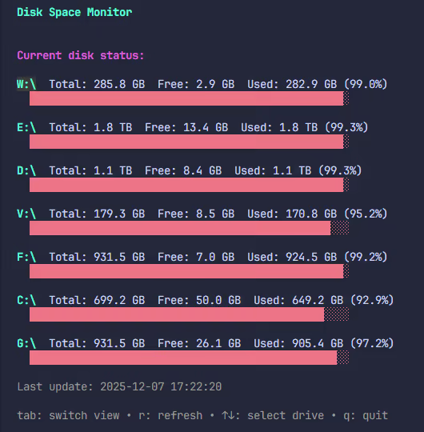
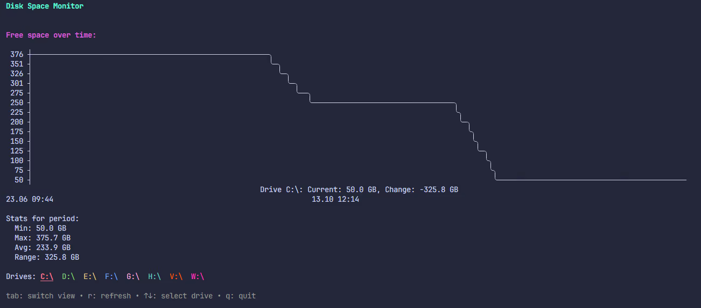

# Disk monitor

A disk monitoring utility for Windows.

 

## Installation

1. Make sure you have Go installed (version 1.18 or higher)

2. Create a new directory for the project:

```bash
mkdir disk-monitor
cd disk-monitor
```

3. Initialize a Go module:

```bash
go mod init disk-monitor
```

4. Install dependencies:

```bash
go get github.com/gizak/termui/v3
```

5. Save the code from the first artifact into a file called main.go

6. Build the program:

```bash
go build -o disk-monitor.exe main.go
```

## Usage

### Collecting disk data

Just run the program without any arguments:

```bash
disk-monitor.exe
```

The program will:

- Scan all available drives
- Show info for each drive (total size, free space, used space)
- Save the data to disk_monitor_history.json in the user's home folder
- Append new entries to that file every time you run it

### Viewing the graph

To display a graph of free space over time, use the `-graph` flag:

```bash
disk-monitor.exe -graph
```

The graph shows:

- Different colored lines for each drive
- Free space in gigabytes on the Y axis
- Measurement numbers on the X axis
- Dates and times of each measurement at the bottom
- A legend with color coding for the drives

Press any key to exit graph mode.

## Automation

You can set up automatic runs using Windows Task Scheduler:

1. Open Task Scheduler
2. Create a new task
3. Set up a trigger (e.g. daily or at logon)
4. In Actions, point it to `disk-monitor.exe`

## Data format

Data is stored in JSON format at `%USERPROFILE%\disk_monitor_history.json`:

```json
{
  "snapshots": [
    {
      "timestamp": "2024-01-15T10:30:00Z",
      "disks": [
        {
          "drive": "C:\\",
          "total_space": 500000000000,
          "free_space": 150000000000,
          "used_space": 350000000000
        }
      ]
    }
  ]
}
```

## Notes

- The program uses Windows API to get disk info, so it only works on Windows
- The graph looks best in terminals that support Unicode and colors (Windows Terminal, ConEmu, etc.)
- If your terminal doesn’t support fancy rendering, the graph might look messed up
